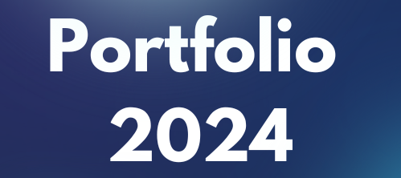

### *Sobre o Projeto*
O projeto se consiste na criação do meu primeiro portfolio. Nele estarei demonstrando tanto minhas habilidades como desenvolvedor Frontend quanto desenvolvedor Backend, acredito que mostrará também minhas habilidades no hobby de designer. O projeto irar ter uma API(Application Programming Interface) no Backend com todas as rotas necessárias para o funcionamento do site. 

Nesta API conterá um CRUD(Create, Read, Update, Delete) para cadastrar meus *projetos*, também terá um formulário para permitir meu login com acesso como administrador. Com isso não irei precisar mexer no código fonte toda vez que criar um novo projeto, já que bastará apenas definir no CRUD as informações do projeto para cadastra-lo no site.

A criação do código Backend segue a padronização MVC(Model, Viewer, Controller), assim divindindo a aplicação em três camadas ocasionando numa melhor reparação e compreenssão do código, além disso o código segue as boas práticas do livro Clean Code. No Frontend também foi segui as boas práticas no uso de tags, e o mesmo se equivale na boas práticas no CSS.

O nome Portfolio 2024 é apenas por intuito informativo, já que informa quando foi realizado ou finalizado o projeto.
