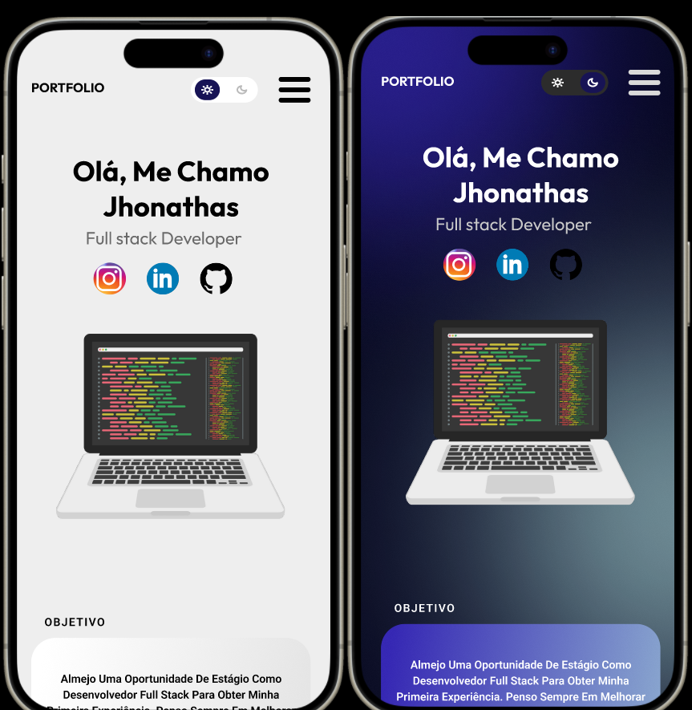
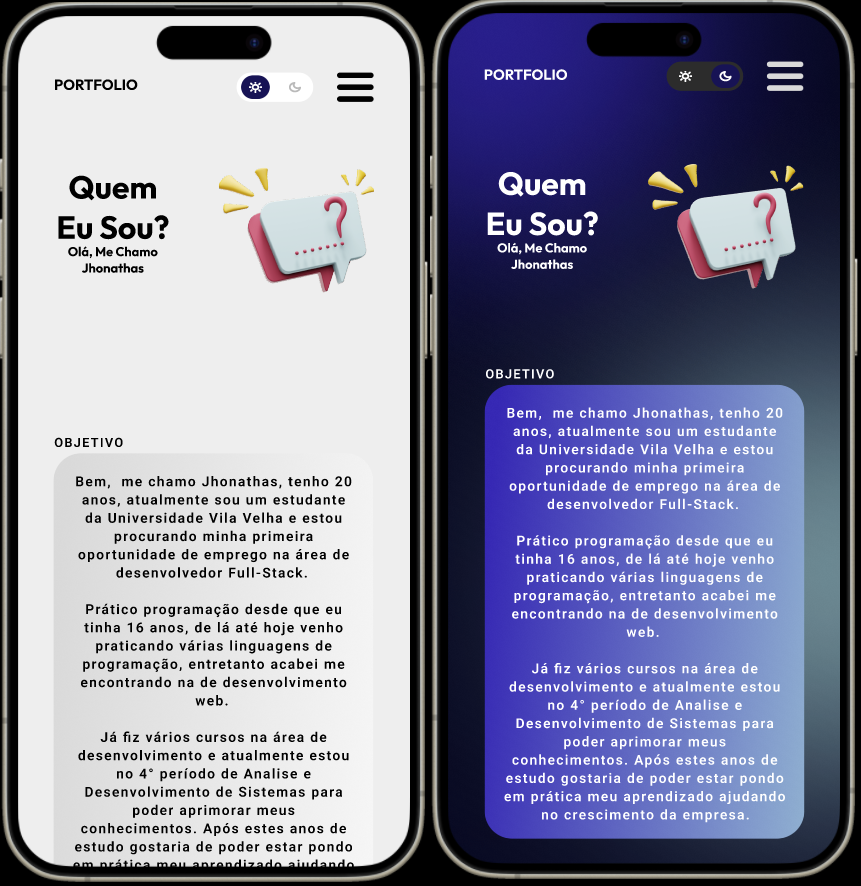
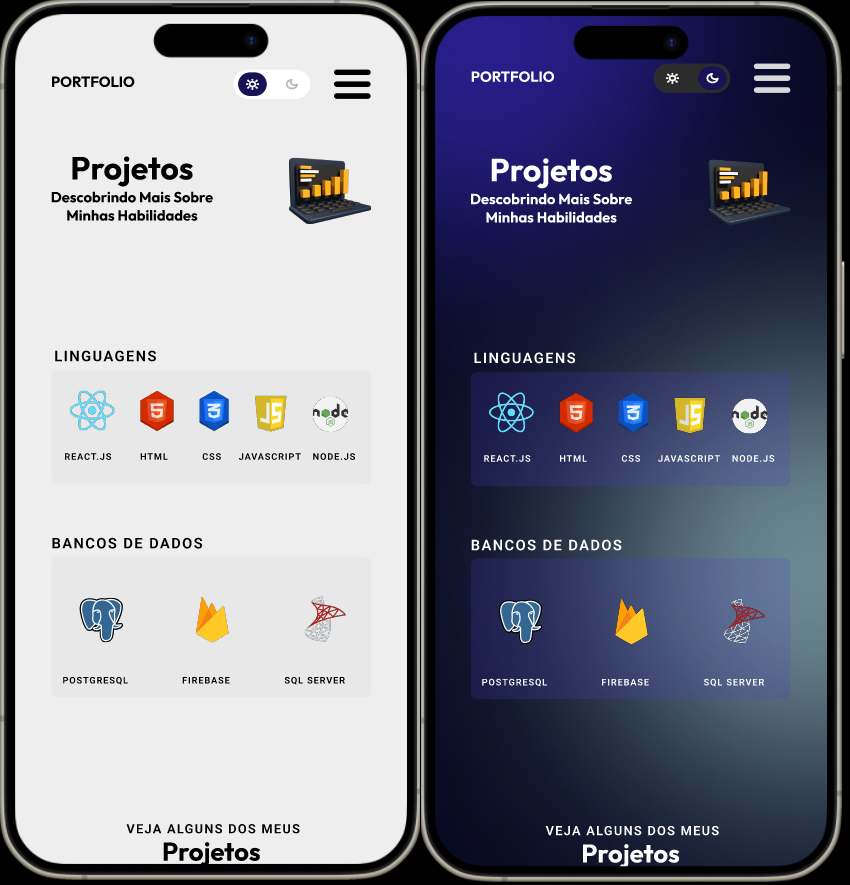

## *Introdução*
O projeto se consiste na criação do meu primeiro portfolio. Nele estarei demonstrando tanto minhas habilidades como desenvolvedor Frontend quanto desenvolvedor Backend, acredito que mostrará também minhas habilidades no hobby de designer. O projeto irar ter uma API(Application Programming Interface) no Backend com todas as rotas necessárias para o funcionamento do site. 

Nesta API conterá um CRUD(Create, Read, Update, Delete) para cadastrar meus *projetos*, também terá um formulário para permitir meu login. Com isso não irei precisar mexer no código fonte toda vez que criar um novo projeto, já que bastará apenas definir no CRUD as informações do projeto para cadastra-lo no site.

A criação do código Backend segue a padronização Arquitetura Rest, assim a aplicação possui uma melhor reparação e compreenssão do código, além disso o código segue as boas práticas do livro Clean Code. O uso das tags no frontend foi realizado de forma semântica, ocasionando numa melhor compreenssão. 

O nome Portfolio 2024 é apenas por intuito informativo, já que informa o perído da criação do projeto.

### Bibliotecas:
- Cors
- Multer
- Dotenv
- Bycriptjs
- express
- express-validator
- JsonWebtoken
- React Router Dom
- React icons
- @Reduxjs/toolkit

### Desginer:

