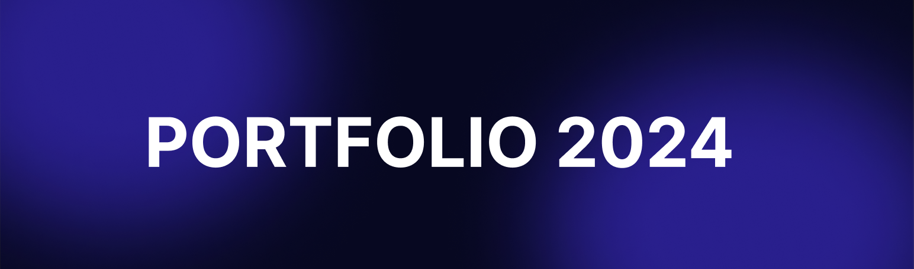

[Website](https://portfolio2024-e4t3.vercel.app/)

## *Introduction*
The project consists of creating my first portfolio. In it I will be demonstrating both my skills as a Frontend developer and Backend developer, I believe it will also show my skills in the designer hobby. The project will have an API (Application Programming Interface) in the Backend with all the routes necessary for the website to function.

This API will contain a CRUD (Create, Read, Update, Delete) to register my *projects*, it will also have a form to allow me to login. This means I won't need to touch the source code every time I create a new project, as it will be enough to simply define the project information in CRUD to register it on the website.

The creation of the Backend code follows the Rest Architecture standardization, so the application has better repair and understanding of the code, in addition the code follows the good practices of the Clean Code book. The use of tags in the frontend was carried out semantically, resulting in better understanding.

The name Portfolio 2024 is for informational purposes only, as it informs the period in which the project was created.

 

## *Introdução*
O projeto se consiste na criação do meu primeiro portfolio. Nele estarei demonstrando tanto minhas habilidades como desenvolvedor Frontend quanto desenvolvedor Backend, acredito que mostrará também minhas habilidades no hobby de designer. O projeto irar ter uma API(Application Programming Interface) no Backend com todas as rotas necessárias para o funcionamento do site. 

Nesta API conterá um CRUD(Create, Read, Update, Delete) para cadastrar meus *projetos*, também terá um formulário para permitir meu login. Com isso não irei precisar mexer no código fonte toda vez que criar um novo projeto, já que bastará apenas definir no CRUD as informações do projeto para cadastra-lo no site.

A criação do código Backend segue a padronização Arquitetura Rest, assim a aplicação possui uma melhor reparação e compreenssão do código, além disso o código segue as boas práticas do livro Clean Code. O uso das tags no frontend foi realizado de forma semântica, ocasionando numa melhor compreenssão. 

O nome Portfolio 2024 é apenas por intuito informativo, já que informa o perído da criação do projeto.

  

### Bibliotecas | libraries:
- Cors
- Multer
- Dotenv
- Bycriptjs
- express
- express-validator
- JsonWebtoken
- React Router Dom
- React icons
- @Reduxjs/toolkit

  

### Desginer:

